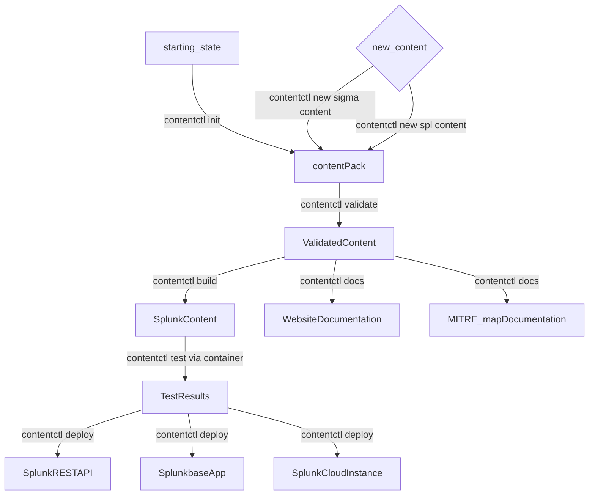
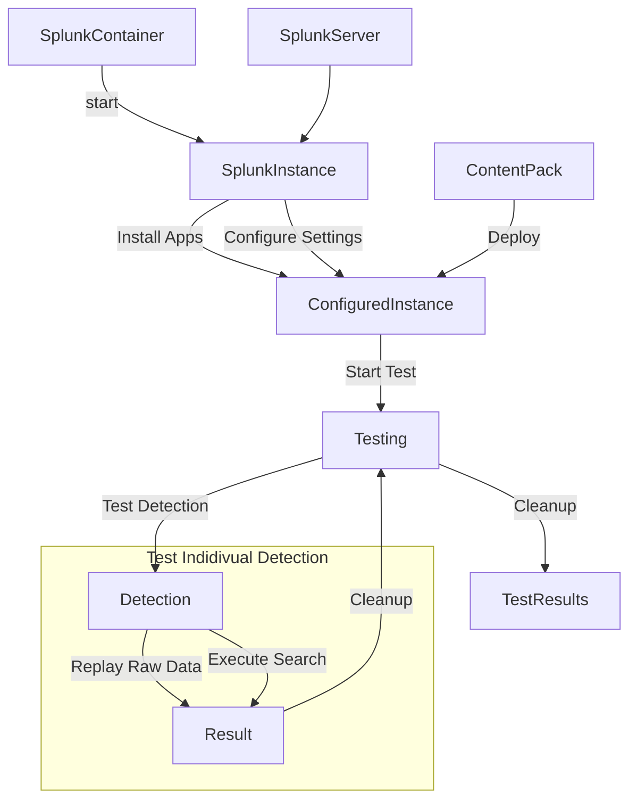

# contentctl
<p align="center">
</p>


# Introduction
#### Security Is Hard 
Anyone who has managed a [SOC](#acronyms) will tell you it's hard work.  SOC Managers, Detection Engineers, and Cybersecurity Professionals must understand and manage countless tools and data sources while ensuring the reliability and security of their network and applications.  At the same time, they must be able to detect and react to data breeches, vulnerabilities, and performance degradation in minutes - not seconds or hours.
These responsibilities leave little time for writing new content - let alone documentation, maintenance, and testing of legacy content.  Existing solutions like Wikis, JIRA tickets, Excel Spreadsheets, and "asking that one team member who knows everything" don't scale and spread information across various systems.       
#### contentctl Makes It ~~Easy~~ Less Hard 
contentctl is a single application that support the full cycle of security content development (each of the links below will redirect to the appropriate section of the README/Wiki):

- [Create Content Packs](#contentctl-init) - Version-Controlled collections of searches, documentation, and test data
- [Add New Content](#contentctl-new---type-type) - searches, macros, lookups, and other content
- [Statically Validate](#contentctl-validate) Content Against a Well-Defined Baseline
- [Building](#contentctl-build) a Content Pack for your target - Use a supported output format or design your own
- [Test](#contentctl-test) your Content Pack on a running Splunk Instance
- [Deploy](#contentctl-deploy) your Content Pack to Splunk Cloud Instance, via REST API, or create a Splunkbase Application for manual deployment   
 
 
 # Ecosystem
| Project               | Description                                             |
| --------------------- | ------------------------------------------------------- |
| [Splunk Attack Range](https://github.com/splunk/attack_range)          | Easily deploy a preconfigured Splunk Environment locally or on AWS containing a Splunk Instance, Windows and Linux Machines, and Attacker Tools like Kali Linux.  Automatically simulate attacks or run your own|
| [PurpleSharp Attack Simulation](https://github.com/mvelazc0/PurpleSharp) | Open source adversary simulation tool for Windows Active Directory environments (integrated into Attack Range)|
| [Red Canary Atomic Red Team](https://github.com/redcanaryco/atomic-red-team)          | Library of attack simulations mapped to the MITRE ATT&CK® framework (integrated into Attack Range)|
| [Splunk Attack Data](https://github.com/splunk/attack_data)          | Repository of Attack Simulation Data for writing and Testing Detections|                         |
| [Splunk Security Content](https://github.com/splunk/security_content)          | Splunk Threat Research Team's Content included in the [Enterprise Security Content Update App (ESCU)](https://splunkbase.splunk.com/app/3449)|
| [Splunk contentctl](https://github.com/splunk/contentctl)          | Generate, validate, build, test, and deploy custom Security Content|
| [SigmaHQ Sigma Rules](https://github.com/SigmaHQ/sigma) | Official Repository for Sigma Rules. These rules are an excellent starting point for new content. |


## Workflow


## Installation
### Requirements
Testing is run using [GitHub Hosted Runners](https://docs.github.com/en/actions/using-github-hosted-runners/about-github-hosted-runners).  Ubuntu22.04 is the recommended configuration.
| Operating System | Supported | Passing Intregration Tests | 
| ---------------- | --------- | ------ |
| Windows 10       | Yes       | Not tested yet |
| Windows 11       | Yes       | Not tested yet |
| Ununtu 20.04 LTS | Yes       | YES (locally + GitHub Actions) |
| *Ubuntu 22.04 LTS| Yes       | YES (locally + GitHub Actions) |
| macOS Montery 12       | Yes       | Not tested yet |
| macOS Ventura 13       | Yes (Intel and Apple Silicon)      | Yes (locally) |

| Requirement | Supported | Description |  Passing Integration Tests |
| --------------------- | ----- | ---- | ------ |
| Python <3.9 | No | No support planned.  contentctl tool uses modern language constructs not supported ion Python3.8 and below | N/A |
| Python 3.9 | Yes | contentctl tool is written in Python | Yes (locally + GitHub Actions) |
| Python 3.10 | Yes | contentctl tool is written in Python | Yes (locally + GitHub Actions) |
| Python 3.11 | Yes | contentctl tool is written in Python | Yes (locally + GitHub Actions)  |
| Docker (local) | Yes | A running Splunk Server is required for Dynamic Testing.  contentctl can automatically create, configure, and destroy this server as a Splunk container during the lifetime of a test. | (locally + GitHub Actions) |
| Docker (remote) | Planned | A running Splunk Server is required for Dynamic Testing.  contentctl can automatically create, configure, and destroy this server as a Splunk container during the lifetime of a test. | No |


**Because contentctl uses a large number of dependencies, it's recommended to install contentctl in a virtual environment. 
The instructions below using "poetry" ALSO follow this recommendation.  Poetry will automatically create a new virtual environment for you.  
It is typically recommended to install poetry to the Global Python Environment.**

#### Install via pip (recommended): 
```
python3.9 -m venv .venv
source .venv/bin/activate
pip install contentctl
```

#### From Source (advanced)
```
git clone https://github.com/splunk/contentctl
cd contentctl
python3.9 -m pip install poetry
poetry install
poetry shell
contentctl --help
```


# Usage

### contentctl init
Creates a new Content Pack in the current directory as well as a configuration file called [contentctl.yml](/contentctl/templates/contentctl_default.yml) which contains a number of important configuration options.
The content pack contains a wide variety of content types:
- [detections](/contentctl/objects/detection.py) - A piece of content that wraps and enriches a Splunk Search.  [Example Detection](/contentctl/templates/detections/anomalous_usage_of_7zip.yml)
- [baselines](/contentctl/objects/baseline.py) - This content is not currently supported.
- [lookups](/contentctl//objects/lookup.py) - Static files, such as CSVs, that can be loaded into Splunk for use in lookup commands.  [Example Lookup](https://github.com/splunk/security_content/blob/develop/lookups/attacker_tools.csv)
- [macros](/contentctl/objects/macro.py) - Common code that is re-used across a wide set of detections.  [Example Macro](/contentctl/templates/macros/security_content_summariesonly.yml) 
- [stories](/contentctl/objects/story.py) - Analytic Stories Allow a developer to tie together a group of detections, for example detections that all relate to Ransomware. [Example Analytic Story](/contentctl/templates/stories/cobalt_strike.yml)

### contentctl validate
Performs static validation on all of the content in this Content Pack.  Writing validation is extremely complex.  Each piece of content can one or dozens of fields ranging from free text to numbers to references to other content.  contentctl's build in validation ensures that a number of conditions are met:
- Required fields in content are defined
- Values in fields are appropriate.  For example, if content references a Datamodel, then that Datamodel must be valid. Similarly, numeric values that must fall within a certain range must be validated.
- If a piece of content references other content, then it exists.  For example, if a detection makes use of a macro then the existence and correctness of the macro must be validated.
- There are no conflicts between content.  For example, two detections cannot have the same name.
If any of these conditions are not met, then a descriptive error will be printed and contentctl will return a nonzero exit code.  This makes it suitable for running in an automated workflow or other CICD context.  Instead of exiting on the first error, _contentctl validate_ will continue validating all content so that it can present all relevant error before exiting.

### contentctl build
Generates Content Packs in the output format defined in the [contentctl.yml](/contentctl/templates/contentctl_default.yml) configuration file.  These outputs may include {splunk_app, api, ba}.  When _contentctl build_ runs, it first performs a _contentctl validate_ in order to ensure that a valid app is generated.  Note that it is *NOT* required or recommended to run _contentctl validate_ separately if the intention is to build a Content Pack.

### contentctl report 
This section is under active development.  It will allow you to a [MITRE Map](https://mitremap.splunkresearch.com/) showing your coverage of MITRE Techniques.  The link here shows the generation of that MITRE Map using the content in Splunk's [security_content repo](https://github.com/splunk/security_content).

### contentctl new [--type TYPE]
Choose TYPE {detection, story} to create new content for the Content Pack.  The tool will interactively ask a series of questions required for generating a basic piece of content and automatically add it to the Content Pack.

### contentctl inspect
This section is under development.  It will enable the user to perform an appinspect of the content pack in preparation for deployment onto a Splunk Instance or via Splunk Cloud.

### contentctl deploy
The reason to build content is so that it can be deployed to your environment.  However, deploying content to multiple servers and different types of infrastructure can be tricky and time-consuming.  contentctl makes this easy by supporting a number of different deployment mechanisms. Deployment targets can be defined in [contentctl.yml](/contentctl/templates/contentctl_default.yml).
- Deploy via API - Using the REST API, individual pieces of content are deployed to a running server.  This is a great way to deploy all of the content in a content pack, but can also be used to deploy individual peices of content.
- Deploy to Splunk Cloud via ACS - Using the Automated Private App Vetting (APAV) Feature of the Admin Config Service (ACS), Splunk Cloud customers can easily deploy custom apps to their environments.   

### contentctl docs
This section is under active development.  It will allow you to easily generate verbose [web-based documentation](https://research.splunk.com) from all of your content.  The link here shows the generation of that documentation using the content in Splunk's [security_content repo](https://github.com/splunk/security_content).

### contentctl test
The static validation performed by *contentctl validate* can only take you so far.  While it's powerful, and fast, it can only tell determine if the content is *syntactically* correct.  *contentctl test* can test your content on real Splunk Infrastructure to ensure there are no errors in your SPL, raw data can be properly ingested/processed/accelerated on your server, your search finds the event(s) you're looking for in raw data, and even provides high-level runtime performance metrics about your searches.    As part of this workflow, a large number of apps will be installed by default.  You can see, and edit, the list of apps in the [app_default.yml](/contentctl/templates/app_default.yml) file.  We plan on making this even easier to update in the future, so stay tuned for updates.
The following diagram shows this workflow at a high level.



#### Testing Modes
There are a number of different testing modes that control which content will be tested.  This can be controlled with the `--mode {}` option at the command line
- all - This will test all of the content in the content pack. Please note that by default only detections marked production will be tested (detections marked as deprecated or experimental, for example, will be ignored).
- selected - Detections whose relative paths are provided on the command line will be tested.  This is particularly useful if you would like to troubleshoot or update just a handful of detections and can save a significant amount of time.  For example, to test two detections use the following command `contentctl test --mode selected --detections_list detections/detection_one.yml detections/detection_two.yml`
- **changes - (not currently supported) If you have a large number of detections and use a branching workflow to create new content or update content, then this is an easy way to automatically find and test only that content automatically.  This prevents you from needing to explicitly list the subset of content to test using "selected"** 

#### Testing Behavior
contentctl test's default mode allows it to quickly test all content with requiring user interaction.  This makes it suitable for local tests as well as CI/CD workflows.  However, users often want to troubleshoot a test if it fails.  contentctl allows you to change the tool's behavior if and/or when a test fails:
- --behavior never_pause - The default behavior.  If a test does not pass, the tool begins the next test immediately
- --behavior pause_on_failure - If a test fails, then additional information about that test, and the raw SPL of the test, is printed to the terminal.  A user may then click (or CMD+Click) the "LINK" to begin interactively debugging the failed test on the Splunk Server.  Note that the credentials for the server are printed out at the very beginning of the test.  After you have finished debugging the failure, hit "Return" in the terminal to move on to the next test. The attack_data for this test remains loaded on the server for debugging until the user moves on to the next test.
- --behavior always_pause - Similar to pause_on_failure, but this pauses after every test regardless of whether it passes or fails.  


1. **init** - Initilialize a new repo from scratch so you can easily add your own content to a custom application. 
2. **new** - Creates new content (detection, story)
3. **validate** - Validates written content
4. **build** - Builds an application suitable for deployment on a search head using Slim, the Splunk Packaging Toolkit
5. **deploy** - Deploy the security content pack to a Splunk Server
6. **docs** - Create documentation as Markdown
7. **reporting** - Create different reporting files such as a Mitre ATT&CK overlay

# Shell tab-complete

Leveraging the tab completion featureset of the CLI library we're using, you can generate tab completions for `contentctl` automatically, for zsh, bash, and tcsh. For additional details, you can view the docs for the library [here.](https://brentyi.github.io/tyro/tab_completion/) 

### Zsh
If you already have a location for your ZSH tab completions, you only need to run the generation line and can skip the folder creation, configuring the rest to fit with your shell config.

```zsh
mkdir -p ~/.zfunc
contentctl --tyro-write-completion zsh ~/.zfunc/_contentctl
echo "fpath+=~/.zfunc" >> ~/.zshrc
echo "autoload -Uz compinit && compinit" >> ~/.zshrc
source ~/.zshrc
```

### Bash

```bash
completion_dir=${BASH_COMPLETION_USER_DIR:-${XDG_DATA_HOME:-$HOME/.local/share}/bash-completion}/completions/
mkdir -p $completion_dir
contentctl --tyro-write-completion bash ${completion_dir}/_contentctl
```

# Acronyms
| Acronym | Meaning| Description | 
| --------------------- | ------------------------------------------------------- | ---- |
| SOC | Security Operation Center | Description of a SoC | 
| DaC | Detection as Code | A systematic approach applying DevOps priciples to Detection Engineering. DaC enables Continuous Integration and Continuous Delivery of Detectionsa via automated validation, testing, and deployment |
| CICD | Continuous Integration/Continuous Delivery | A modern DevOps practice that encourages users to make small, frequent changes which are automatically tested and deployed. This contrasts with legacy approaches that emphasize large changes which may be manually tested an infrequently deployed. |
| ACS| Admin Config Service | The [Splunk Admin Config Service](https://docs.splunk.com/Documentation/SplunkCloud/9.0.2209/Config/ACSIntro) is a cloud-native API that provides programmatic self-service administration capabilities for Splunk Cloud Platform. One of its features, Automated Private App Vetting (APAV) enables the installation of custom app on Splunk Cloud instances. | 
| APAV | Automated Private App Vetting | [Automated Private App Vetting](https://docs.splunk.com/Documentation/SplunkCloud/9.0.2209/Config/ManageApps) enables admins to use the ACS API to install, upgrade, and uninstall apps directly on your Splunk Cloud Platform deployment without assistance from Splunk Support. |


# License
Copyright 2023 Splunk Inc.

Licensed under the Apache License, Version 2.0 (the "License"); you may not use this file except in compliance with the License. You may obtain a copy of the License at

http://www.apache.org/licenses/LICENSE-2.0

Unless required by applicable law or agreed to in writing, software distributed under the License is distributed on an "AS IS" BASIS, WITHOUT WARRANTIES OR CONDITIONS OF ANY KIND, either express or implied. See the License for the specific language governing permissions and limitations under the License.
