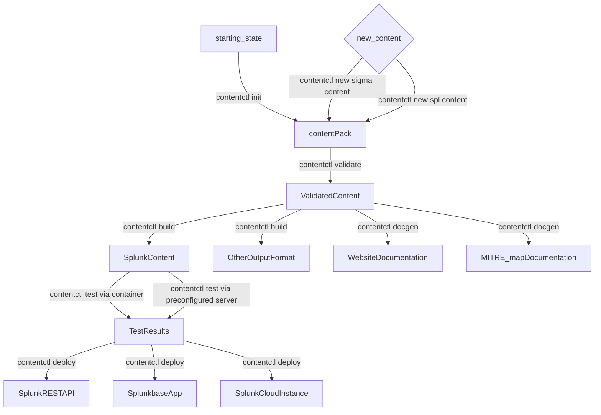

# Splunk Contentctl

=====

# Acronyms
SOC - Security Operation Center

# Introduction
#### Security Is Hard 
Anyone who has managed a [SOC](acronym) will tell you it's hard work.  SOC Managers, Detection Engineers, and Cybersecurity Professionals must understand and manage countless tools and data sources while ensuring the reliability and security of their network and applications.  At the same time, they must be able to detect and react to data breeches, vulnerabilities, and performance degradation in minutes - not seconds or hours.
These responsibilities leave little time for writing new content - let alone documentation, maintenance, and testing of legacy content.  Existing solutions like Wikis, JIRA tickets, Excel Spreadsheets, and "asking that one team member who knows everything" don't scale and spread information across various systems.       
#### contentctl Makes It ~~Easy~~ Less Hard 
contentctl is a single application that support the full cycle of security content development (each of the links below will redirect to the appropriate section of the README/Wiki):

- [Create Content Packs](contentctl-init) - Version-Controlled collections of searches, documentation, and test data
- [Add New Content](contentctl-new-content) - searches, macros, lookups, and other content
- [Statically Validate](contentctl-validate) Content Against a Well-Defined Baseline
- [Building](contentctl-build) a Content Pack for your target - Use a supported output format or design your own
- [Generate](contentctl-generate) documentation, MITRE Maps, and a website that makes your Content Pack searchable and easy to understand  
- [Test](contentctl-test) your Content Pack on a running Splunk Instance
- [Deploy](contentctl-deploy) your Content Pack to Splunk Cloud Instance, via REST API, or create a Splunkbase Application for manual deployment   
 
 
 
 # Ecosystem
| Project               | Description                                             |
| --------------------- | ------------------------------------------------------- |
| [Splunk Attack Range](https://github.com/splunk/attack_range)          | Easily deploy a preconfigured Splunk Environment locally or on AWS containing a Splunk Instance, Windows and Linux Machines, and Attacker Tools like Kali Linux.  Automatically simulate attacks or run your own|
| [PurpleSharp Attack Simulation](https://github.com/mvelazc0/PurpleSharp) | Open source adversary simulation tool for Windows Active Directory environments (integrated into Attack Range)|
| [Red Canary Atomic Red Team](https://github.com/redcanaryco/atomic-red-team)          | Library of attack simulations mapped to the MITRE ATT&CK® framework (integrated into Attack Range)|
| [Splunk Attack Data](https://github.com/splunk/attack_data)          | Repository of Attack Simulation Data for writing and Testing Detections|                         |
| [Splunk Security Content](https://github.com/splunk/security_content)          | Splunk Threat Research Team's Content included in the [Enterprise Security Content Update App (ESCU)](https://splunkbase.splunk.com/app/3449)|
| [Splunk contentctl](https://github.com/splunk/contentctl)          | Generate, validate, build, test, and deploy custom Security Content|
| [Other Important Project(s)](https://github.com/otherorg/projectname)          | Additional projects that exist in the STRT Cinematic Universe - are there any more to add?|


## Workflow


## Installation


### Using pip (Available when released)
Install contentctl using pip: 
```
pip install splunk-contentctl
```

### From Source
Make sure you have poetry installed:
```
git clone git@github.com:splunk/contentctl.git
poetry install
poetry shell
contentctl --help
```


## Usage

1. **init** - Initilialize a new repo from scratch so you can easily add your own content to a custom application. 
2. **new** - Creates new content (detection, story)
3. **validate** - Validates written content
4. **build** - Builds an application suitable for deployment on a search head using Slim, the Splunk Packaging Toolkit
5. **deploy** - Deploy the security content pack to a Splunk Server
6. **docs** - Create documentation as Markdown
7. **reporting** - Create different reporting files such as a Mitre ATT&CK overlay


