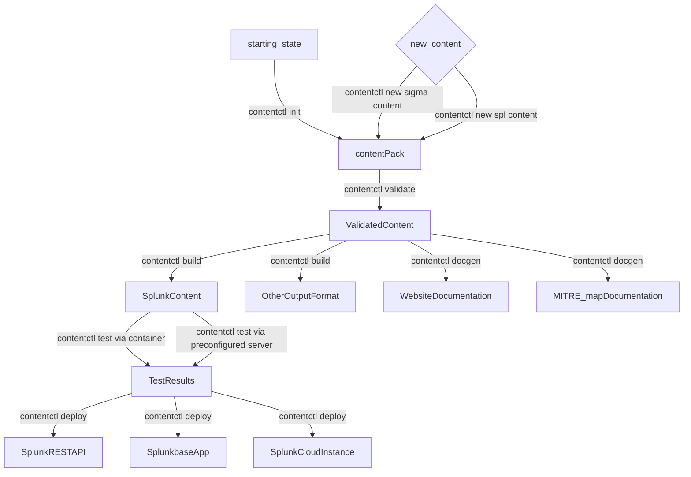

# Splunk Contentctl

=====


# Introduction
#### Security Is Hard 
Anyone who has managed a [SOC](acronym) will tell you it's hard work.  SOC Managers, Detection Engineers, and Cybersecurity Professionals must understand and manage countless tools and data sources while ensuring the reliability and security of their network and applications.  At the same time, they must be able to detect and react to data breeches, vulnerabilities, and performance degradation in minutes - not seconds or hours.
These responsibilities leave little time for writing new content - let alone documentation, maintenance, and testing of legacy content.  Existing solutions like Wikis, JIRA tickets, Excel Spreadsheets, and "asking that one team member who knows everything" don't scale and spread information across various systems.       
#### contentctl Makes It ~~Easy~~ Less Hard 
contentctl is a single application that support the full cycle of security content development (each of the links below will redirect to the appropriate section of the README/Wiki):

- [Create Content Packs](contentctl-init) - Version-Controlled collections of searches, documentation, and test data
- [Add New Content](contentctl-new-content) - searches, macros, lookups, and other content
- [Statically Validate](contentctl-validate) Content Against a Well-Defined Baseline
- [Building](contentctl-build) a Content Pack for your target - Use a supported output format or design your own
- [Generate](contentctl-generate) documentation, MITRE Maps, and a website that makes your Content Pack searchable and easy to understand  
- [Test](contentctl-test) your Content Pack on a running Splunk Instance
- [Deploy](contentctl-deploy) your Content Pack to Splunk Cloud Instance, via REST API, or create a Splunkbase Application for manual deployment   
 
 
 
 # Ecosystem
| Project               | Description                                             |
| --------------------- | ------------------------------------------------------- |
| [Splunk Attack Range](https://github.com/splunk/attack_range)          | Easily deploy a preconfigured Splunk Environment locally or on AWS containing a Splunk Instance, Windows and Linux Machines, and Attacker Tools like Kali Linux.  Automatically simulate attacks or run your own|
| [PurpleSharp Attack Simulation](https://github.com/mvelazc0/PurpleSharp) | Open source adversary simulation tool for Windows Active Directory environments (integrated into Attack Range)|
| [Red Canary Atomic Red Team](https://github.com/redcanaryco/atomic-red-team)          | Library of attack simulations mapped to the MITRE ATT&CK® framework (integrated into Attack Range)|
| [Splunk Attack Data](https://github.com/splunk/attack_data)          | Repository of Attack Simulation Data for writing and Testing Detections|                         |
| [Splunk Security Content](https://github.com/splunk/security_content)          | Splunk Threat Research Team's Content included in the [Enterprise Security Content Update App (ESCU)](https://splunkbase.splunk.com/app/3449)|
| [Splunk contentctl](https://github.com/splunk/contentctl)          | Generate, validate, build, test, and deploy custom Security Content|
| [SigmaHQ Sigma Rules](https://github.com/SigmaHQ/sigma) | Official Repository for Sigma Rules. These rules are an excellent starting point for new content. |
| [Other Important Project(s)](https://github.com/otherorg/projectname)          | Additional projects that exist in the STRT Cinematic Universe - are there any more to add?|


## Workflow


## Installation
### Requirements
Testing is run using [GitHub Hosted Runners](https://docs.github.com/en/actions/using-github-hosted-runners/about-github-hosted-runners).  Ubuntu22.04 is the recommended configuration.
| Operating System | Supported | Passing Intregration Tests | 
| ---------------- | --------- | ------ |
| Windows 10       | Yes       | [windows10TestBadge](Windows10TestBadge)  |
| Windows 11       | Yes       | [windows11TestBadge](Windows11TestBadge)  |
| Ununtu 20.04 LTS | Yes       | [ubuntu2004TestBadge](ubuntu2004TestBadge)|
| *Ubuntu 22.04 LTS| Yes       | [ubuntu2204TestBadge](ubuntu2204TestBadge)|
| macOS Big Sur 11       | Yes       | [macOS11TestBadge](macOS11TestBadge)|
| macOS Montery 12       | Yes       | [macOS12TestBadge](macOS12TestBadge)|


| Requirement | Required | Description | 
| --------------------- | ----- | ---- |
| Python <3.9 | Not Supported | No support planned.  contentctl tool uses modern language constructs not supported ion Python3.8 and below |
| Python 3.9 | Required | contentctl tool is written in Python |
| Python 3.10 | Not Supported (yet) | Will be supported |
| Python 3.11 | Not Supported (yet) | Will be supported |
| Docker (local or remote) | Recommended | A running Splunk Server is required for Dynamic Testing.  contentctl can automatically create, configure, and destroy this server as a Splunk container during the lifetime of a test.  This is the easiest, and recommended, testing method.  Alternatively, you may specify the address and credentials for a preconfigured server for testing or choose to skip dynamic testing. Please see the page [Dynamic Testing with Docker](testingWithDocker) for important information about performance on macOS |


**Because contentctl uses a large number of dependencies, it's recommended to install it in a virtual environment. The instructions below follow this recommendation.**

#### Install via pip (recommended): 
```
python3.9 -m venv .venv
source .venv/bin/activate
pip install splunk-contentctl
```

#### From Source (advanced)
```
git clone git@github.com:splunk/contentctl.git
cd contentctl
python3.9 -m venv .venv
source .venv/bin/activate
python -m pip install poetry
poetry install
poetry shell
contentctl --help
```


# Usage

### contentctl init
Creates a new Content Pack in the current directory as well as a configuration file called [contentctl.yml](contentctl.yml) which contains a number of important configuration options.
The content pack contains a wide variety of content types:
- [detections](detection)
- [baselines](baseline)
- [lookups](lookup)
- [macros](macro)
- [stories](story)

### contentctl new [--type TYPE]
Choose TYPE {detection, story} to create new content for the Content Pack.  The tool will interactively ask a series of questions required for generating a basic piece of content and automatically add it to the Content Pack.

### contentctl validate
Performs static validation on all of the content in this Content Pack.  Writing validation is extremely complex.  Each piece of content can one or dozens of fields ranging from free text to numbers to references to other content.  contentctl's build in validation ensures that a number of conditions are met:
- Required fields in content are defined
- Values in fields are appropriate.  For example, if content references a Datamodel, then that Datamodel must be valid. Similarly, numeric values that must fall within a certain range must be validated.
- If a piece of content references other content, then it exists.  For example, if a detection makes use of a macro then the existence and correctness of the macro must be validated.
- There are no conflicts between content.  For example, two detections cannot have the same name.
If any of these conditions are not met, then a descriptive error will be printed and contentctl will return a nonzero exit code.  This makes it suitable for running in an automated workflow or other CICD context.  Instead of exiting on the first error, _contentctl validate_ will continue validating all content so that it can present all relevant error before exiting.

### contentctl build
Generates Content Packs in the output format defined in the [contentctl.yml](contentctl.yml) configuration file.  These outputs may include {splunk_app, api, ba}.  When _contentctl build_ runs, it first performs a _contentctl validate_ in order to ensure that a valid app is generated.  Note that it is *NOT* required or recommended to run _contentctl validate_ separately if the intention is to build a Content Pack.

### contentctl report
### contentctl inspect
### contentctl deploy
### contentctl docs
### contentctl test

1. **init** - Initilialize a new repo from scratch so you can easily add your own content to a custom application. 
2. **new** - Creates new content (detection, story)
3. **validate** - Validates written content
4. **build** - Builds an application suitable for deployment on a search head using Slim, the Splunk Packaging Toolkit
5. **deploy** - Deploy the security content pack to a Splunk Server
6. **docs** - Create documentation as Markdown
7. **reporting** - Create different reporting files such as a Mitre ATT&CK overlay


# Acronyms
| Acronym | Meaning| Description | 
| --------------------- | ------------------------------------------------------- | ---- |
| SOC | Security Operation Center | Description of a SoC | 
| DaC | Detection as Code | A systematic approach applying DevOps priciples to Detection Engineering. DaC enables Continuous Integration and Continuous Delivery of Detectionsa via automated validation, testing, and deployment |
| CICD | Continuous Integration/Continuous Delivery | A modern DevOps practice that encourages users to make small, frequent changes which are automatically tested and deployed. This contrasts with legacy approaches that emphasize large changes which may be manually tested an infrequently deployed. |


# License
Copyright 2022 Splunk Inc.

Licensed under the Apache License, Version 2.0 (the "License"); you may not use this file except in compliance with the License. You may obtain a copy of the License at

http://www.apache.org/licenses/LICENSE-2.0

Unless required by applicable law or agreed to in writing, software distributed under the License is distributed on an "AS IS" BASIS, WITHOUT WARRANTIES OR CONDITIONS OF ANY KIND, either express or implied. See the License for the specific language governing permissions and limitations under the License.
