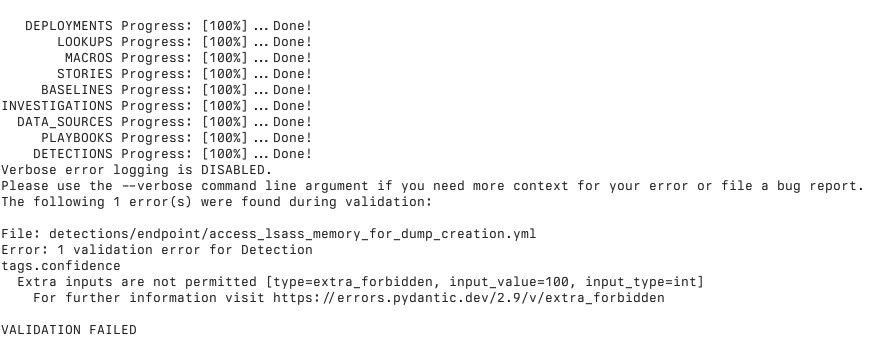

# Time to upgrade!

There are some BIG changes with the v5.0 release of `contentctl` that we think you're going to love. Here are some details about the biggest ones and some tips to help you migrate your own content repos from using v4.x to v5!

### Strict Fields

Over the years, the YAML files we track our content in have had a lot of different fields in them. There have been varying levels of success when it comes to removing the fields that were no longer necessary, which lead to fields that didn't do anything sticking around. This is no longer the case. We've tweaked the settings on the classes to no longer allow extra fields. This will likely create a small pile of work in order to remove them. Common legacy fields within our own content were `datamodel`, `dataset`, as well as some of the fields we've removed as part of the other updates detailed below. You can run `contentctl validate` with a v5.0+ build and get the validation errors for each and every file. The error messages will describe what the error is, such as "Extra inputs are not permitted":



### RBA Changes

Historically, there have been a lot of different fields involved in setting up the Risk Based Alerting configuration for a specific detection. And not all of them used terminology common with Splunk Enterprise Security, or any other Splunk product. We'll use the sample detection from this repository as an example. You can view the v4.x version of the file in full [here](https://github.com/splunk/contentctl/blob/v4.4.7/contentctl/templates/detections/endpoint/anomalous_usage_of_7zip.yml) or the new v5 version of the file in full [here](https://github.com/splunk/contentctl/blob/v5.0.0-alpha.3/contentctl/templates/detections/endpoint/anomalous_usage_of_7zip.yml). 


```YAML
# v4.x
tags:
...
  confidence: 80
  impact: 80
  message: An instance of $parent_process_name$ spawning $process_name$ was identified
    on endpoint $dest$ by user $user$. This behavior is indicative of suspicious loading
    of 7zip.
  observable:
  - name: user
    type: User
    role:
    - Victim
  - name: dest
    type: Hostname
    role:
    - Victim
  - name: parent_process_name
    type: Process
    role:
    - Attacker
  - name: process_name
    type: Process
    role:
    - Attacker
  risk_score: 64
```

Let's break down this example:
- `tags.confidence` and `tags.impact` are integers between 0 and 100 that are then multiplied together and divided by 100 to produce a risk score (64, in this case). 
- The `tags.message` field became the risk message.  
- The `tags.observable` field is where things got really tricky. This was a list of objects that became either risk objects or threat objects. The `name` field for each of these objects was the field in your search results, and the `type` took a lot of different options and for risk objects would translate them to `system` or `user`, generally, while there were LOTS of options for threat objects as ES does not enforce any options for this. Depending on the `role` - objects with a role of `Victim` became risk objects, while the role of `Attacker` became threat objects. All of the risk objects received the same risk score based on the math described above.  
- Your detections may have had a `tags.risk_score` field as well, but that has been a computed field that was not necessary to put in the YAML for several releases now. 

This has been replaced with:

```YAML
# v5.0
rba:
  message: An instance of $parent_process_name$ spawning $process_name$ was identified
    on endpoint $dest$ by user $user$. This behavior is indicative of suspicious loading
    of 7zip.
  risk_objects:
    - field: user
      type: user
      score: 56
    - field: dest
      type: system
      score: 60
  threat_objects:
    - field: parent_process_name
      type: parent_process_name
    - field: process_name
      type: process_name
tags:
...
```

To begin, we have shifted the RBA config out of the `tags` object, and re-oriented it around the actual in-product usage. 
- The `rba.message` field is a direct replacement for the old `tags.message` field. 
- Risk object config is now much more straightforward. `rba.risk_objects` takes a list of risk objects that consist of a `field` (the field from your search), `type` (user, system, or other, and we strongly recommend not using Other), and a `score` - an integer between 0 and 100. The risk scores are no longer derived from an opaque formula that involves computing from other fields. Each risk object can now have their own independent risk score, as detailed in the above snippet.  
- Finally, the threat object config is similarly less complicated. `rba.threat_objects` takes a list of objects consisting of a `field` (the field in your search) and `type` (a selection of fields that can be seen [here](RBA_Types.md)). 

These fields are now also only required AND only allowed when the detection receives a risk-related configuration via its deployment. So, your Hunting searches that power dashboards or your Correlation searches that create risk notables, but don't create more risk on their own- none of those require RBA configs, and `contentctl` will give you an error if they are present.

If you've configured risk actions in Splunk Enterprise Security before, these changes should seem very familiar- because they are. We've largely aligned fields and enum options with the field names and options used in the UI of Enterprise Security.


### Managed Lookup Filenames

Depending on where your Splunk deployment lives (SplunkCloud's Victoria Experience, Classic Experience, or in your own datacenter, or your own public cloud tenant), you may have experienced some significant pains with deploying lookups as part of your app. If you're not already familiar with the peculiar behaviors of lookup file updating, you can read more about it [here](https://docs.splunk.com/Documentation/SplunkCloud/9.3.2408/Admin/PrivateApps#Manage_lookups_in_Splunk_Cloud_Platform). Essentially, depending on what your Splunk deployment looks like, updating an app that has changes to lookup files may cause those new files to be entirely ignored, with the previously used versions staying in use.

We've come up with a solution for this that should generally work for folks, no matter their deployment, that will allow you to use new lookups when you update an app without manually editing them. CSV Lookups in `contentctl` built apps now have a datestamp added to the end of the filename automatically, as derived from the date in the lookup file. This means updating an app adds a new file instead of one that would be ignored during the update process. The lookup definition that gets written to `transforms.conf` also gets this new filename. Our searches leverage the lookup definitions instead of the raw filenames, so when a new version of a lookup appears, it will seamlessly be used in favor of the old one. There are some changes to the lookup YAML files to support this, which will also throw errors (likely, the first errors you'll see as part of migration). You can review the configs used in ESCU for these files [here](https://github.com/splunk/security_content/tree/develop/lookups) if you'd like to see how we're using some of the fields.

### Migration Tips

The recommended order of operations for migrating is as follows:
1. Run `contentctl validate` with the new version. It should fail early on during Lookup validation.
2.  Proceed with cleaning up (removing extra fields, reconfiguring) lookups, stories, and macros.
3. Once you get to the point that you're getting validation errors for detections, you should migrate your RBA config first. Before you delete fields like `tags.impact` and `tags.confidence` you will want to create the new `rba` object so you can use the old config to build a comparable new one. 
4. Once all of your detections that require risk config are ported over to the `rba` object, then you should proceed with removing all of the extra fields. Running `contentctl validate`, removing a few, saving the file, and running validate again as you go should help. 


Depending on how much content you have to migrate, you may consider writing some quick scripts or a notebook that will create the new RBA objects based on your existing configuration before you delete anything. If you go this route, we found great success with [ruamel.yaml](https://pypi.org/project/ruamel.yaml/) as opposed to PyYAML for the sake of preserving the existing order of fields in your YAMLs. _Technically_, the field order doesn't matter when the objects are parsed and read in, but we have found that the consistency of order of fields helps reviewers identify changes, and keeps diffs easy to understand. If you don't have hundreds or thousands of detections in your repo, it may be more valuable to spend time migrating these configurations by hand to ensure that your previous detections were all configured the way you thought they were, and giving you an opportunity to review risk messages, risk scores, and threat objects for improvements.